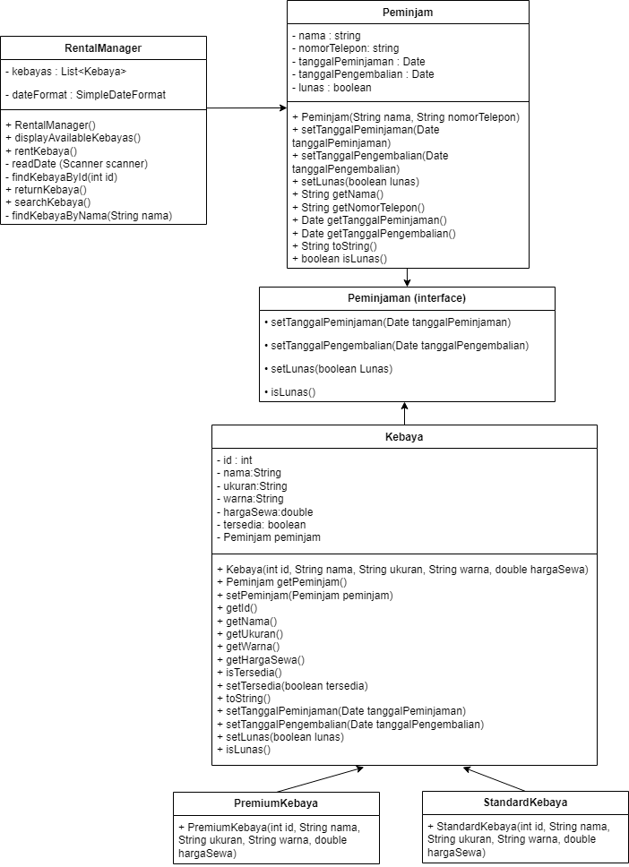
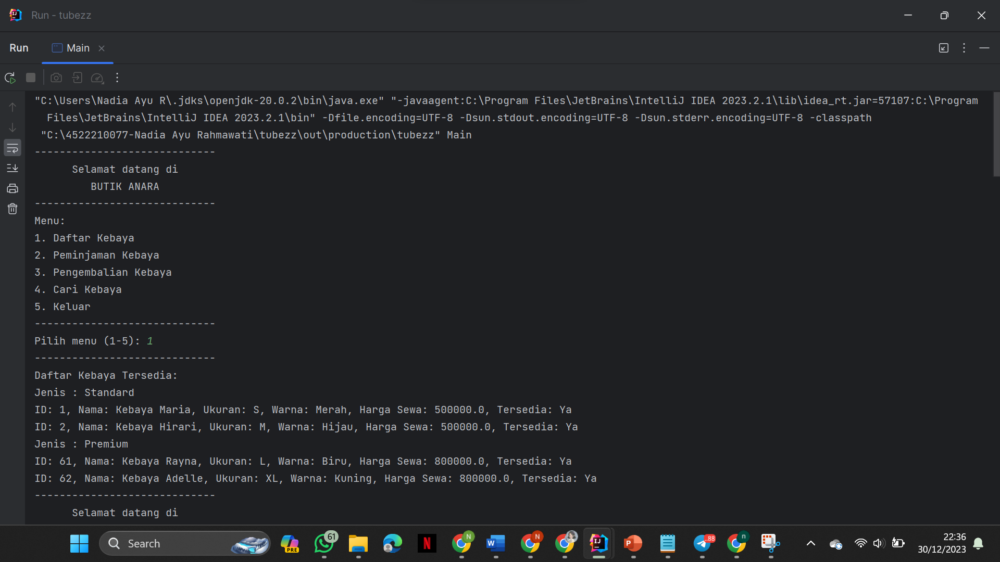
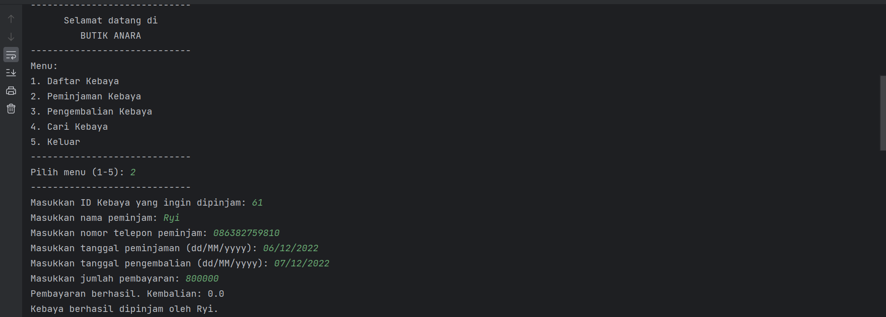
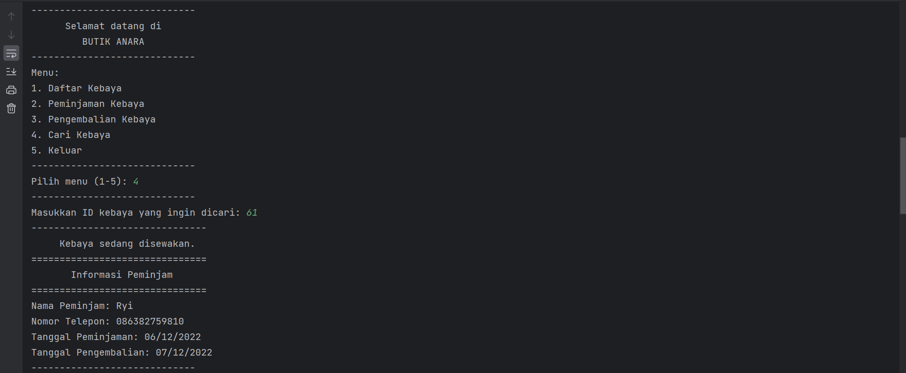
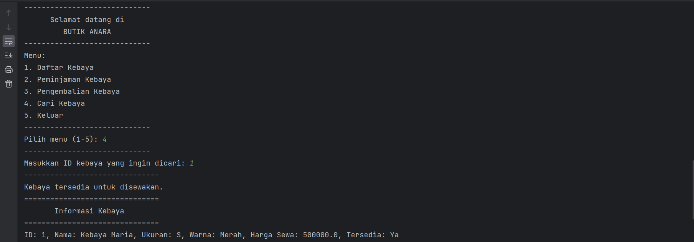
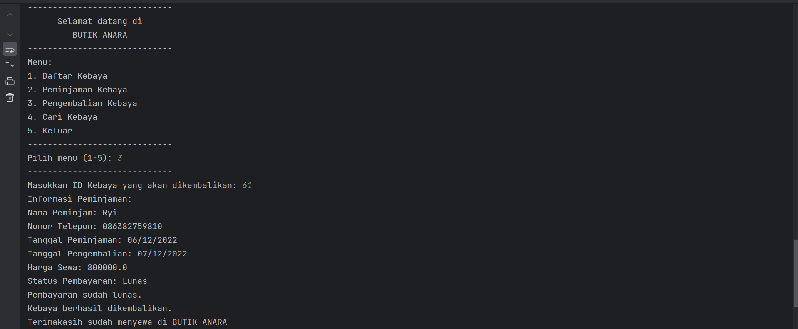
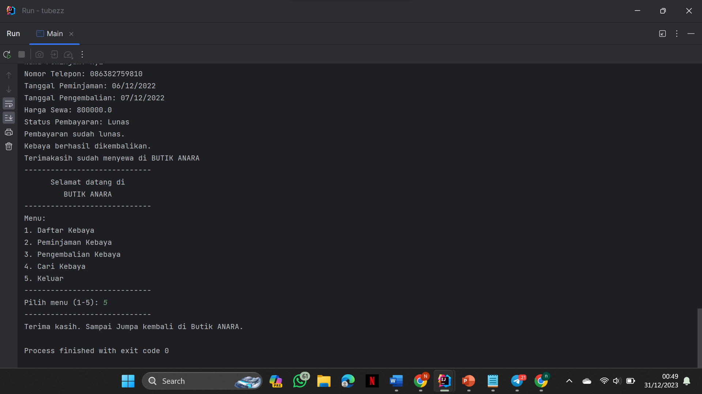

# UAS_PBO_BUTIKPENYEWAAN_45222210077_NADIA_AYU_RAHMAWATI

Deskripsi singkat project Pemograman Berbasis Object.

## Deskripsi Project
Peminjaman kebaya di Butik Anara. Karena kurang efisiensi dalam pelacakan inventaris kebaya yang tersedia dan manajemen peminjaman. Dengan adanya program ini, diharapkan proses manajemen peminjaman kebaya menjadi lebih terstruktur, efisien, dan mudah dilakukan baik untuk pihak butik maupun pelanggan.
## Fitur yang Tersedia
- Peminjaman Kebaya
- Pengembalian Kebaya
- Daftar Kebaya
- Pencarian Kebaya Berdasarkan ID

## library

-  java.util.ArrayList(implementasi dari struktur data dinamis berupa daftar (list))
-  java.util.List;(untuk manipulasi daftar seperti menambah, menghapus, dan mengakses elemen)
-  java.text.ParseException(untuk menangani kesalahan yang terkait dengan pemrosesan teks, khususnya pada operasi penguraian (parsing) atau konversi teks ke dalam objek tertentu.)
-  java.text.SimpleDateFormat(untuk mengonversi antara objek Date dan representasi teks tertentu)
-  java.util.Date(untuk bekerja dengan tanggal dan waktu dalam aplikasi Java.)
-  java.util.Scanner(untuk membaca masukan dari berbagai sumber, seperti keyboard atau file.)
- 
## Diagram Class

## ScreenShoots Program 

